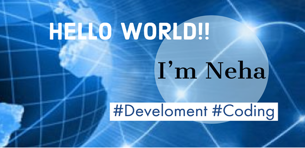

### Hi there 👋, Neha GP
#### Engineering Student

I'm Neha from India, I am an engineering student, I love to explore new technologies, I really enjoy working on Machine Learning projects, and android app development...My Passion for coding and learning will never end..

## Skills and Experience: 
  * ☕♨ Oops with Java  
  * 📚 MY SQL
  * 📱 Android
  * 📠 ML
  * 🗾Python
  * 🌊C

- 🌱 I’m currently learning Data Science with ML

## Examples of Work

    

